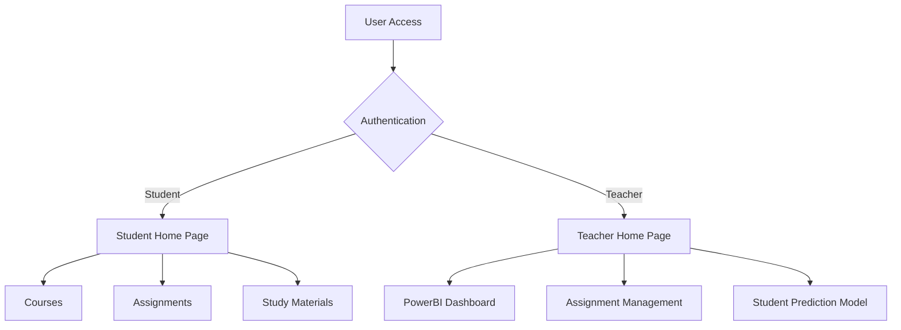

# E-Academy : Secure E-Learning Management System With Content Encryption and Student Performance Prediction Using Neural Networks

## Overview
E-Academy is a comprehensive e-learning platform that incorporates advanced security features, content encryption, and student performance prediction capabilities. The platform provides separate interfaces for students and teachers, enabling efficient learning management and performance tracking.

## Key Features
- Secure user authentication system
- Role-based access control (Student/Teacher)
- Encrypted content delivery
- Student performance prediction using Neural Networks
- Interactive dashboards for performance visualization
- Course management system
- Assignment tracking and submission
- Secure study material distribution

## E-Academy Repositories

- thearmanqureshi : On this GitHub Account the repositories were created to be deployed on Render
     - [thearmanqureshi/E-Academy](https://github.com/thearmanqureshi/E-Academy) : Contains the main project
     - thearmanqureshi/E-Academy-Proxy : Contains the E-Academy Proxy Webpage
     - [thearmanqureshi/E-Academy-Model-Host](https://github.com/thearmanqureshi/E-Academy-Model-Host) : Contains the tensorflow-lite model and scaler for the prediction model

- [anshh-arora/E-Academy](https://github.com/anshh-arora/E-Academy) : On this GitHub Account's Repositorie our team members worked on the E-Acaedmy Project

## Platform Screenshots

### E-Academy Proxy

*E-Academy Proxy Webpage that enhances users expierence and diplays a message until the Render services are started*

### Homepage

*E-Academy homepage featuring sign-in and registration options*

### Student Home Page

*Student interface showing courses, assignments, and study materials*

### Teacher's Dashboard

*Comprehensive teacher dashboard with student performance metrics*

### Performance Prediction Model

*Neural Network-based performance prediction visualization*

## Project Architecture



## Technology Stack
- Frontend: HTML, CSS & JavaScript
- Backend: Python (Flask)
- Database: MongoDB Atlas
- Analytics: PowerBI
- Machine Learning: Neural Networks & TensorFlow Lite
- Security: Flask Bcrypt

## Repository Structure
```
E-Academy-Proxy/
│
├── api/                 
│   └── check-backend.js
│
├── public/
│   └── loading.html
│
├── package.json
├── LICENSE
├── Readme.md
└── vercel.json
```
## Installation and Setup

### Prerequisites
- Python 3.8+
- MongoDB
- PowerBI Desktop (for dashboard visualization)

### Clone the Repository
```bash
https://github.com/thearmanqureshi/E-Academy.git
cd E-Academy
```

### Environment Setup
```bash
python -m venv venv
source venv/bin/activate  # On Windows: venv\Scripts\activate
pip install -r requirements.txt
```

### Configure MongoDB
1. Create a MongoDB database
2. Update the connection string in `config.py`
```python
MONGO_URI = "your_mongodb_connection_string"
```

### Running the Application
```bash
python wsgi.py
```
The application will be available at `http://localhost:5000`

## Team Members and Contributions
- **Arman**: Frontend Development
- **Piyush**: Responsive Design Implementation
- **Ansh**: Neural Network Model Development
- **Karan**: PowerBI Dashboard and Data Visualization

## Contact Information
For any questions or feedback, feel free to reach out:

- **Email**: [thearmanqureshi@gmail.com](mailto:thearmanqureshi@gmail.com)
- **LinkedIn**: [Connect with me on LinkedIn](https://www.linkedin.com/in/thearmanqureshi)
